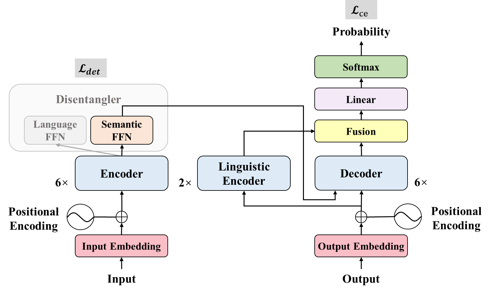

# SemLing-MNMT

Code and scripts for the ACL2024 Findings paper "Improving Multilingual Neural Machine Translation by Utilizing Semantic and Linguistic Features".



## Code

The code is based on the open-source toolkit [fairseq](https://github.com/facebookresearch/fairseq). Our model code `transformer_disentangler_and_linguistic_encoder.py` is in "fairseq/fairseq/models", and our criterion code `label_smoothed_cross_entropy_with_disentangling.py` is in "fairseq/fairseq/criterions".

## Get Started

### Requirements and Installation

* Python version == 3.9.12
* Pytorch version == 1.12.1
* Install fairseq:

    ```shell
    git clone https://github.com/ictnlp/SemLing-MNMT.git
    cd SemLing-MNMT
    pip install --editable ./
    ```

### Data Pre-processing

We use the [Sentencepiece](https://github.com/google/sentencepiece) toolkit to pre-process the [IWSLT2017](https://wit3.fbk.eu/2017-01), [OPUS-7](https://opus.nlpl.eu/opus-100.php) and [PC-6](https://github.com/PANXiao1994/mRASP2) datasets. For each dataset, we implement the Unigram Model algorithm for tokenization and learn a joint vocabulary with 32K tokens.

### Training and Inference

We provide training and inference scripts of IWSLT2017 in the folder "scripts" as examples. Add your pathes to `scripts` and run them.

Here are some explanations:

* In `train.sh`, `--disentangler-lambda`, `--disentangler-reconstruction-lambda`, and `--disentangler-negative-lambda` are hyperparameters corresponding to $\lambda$, $\lambda_1$, $\lambda_2$ in our paper. And `--linguistic-encoder-layers` controls the layer number of the linguistic encoder.

* In `generate.sh` and `generate_zero_shot.sh`, we generate translation and compute BLEU scores with [SacreBLEU](https://github.com/mjpost/sacrebleu) (version == 1.5.1).
